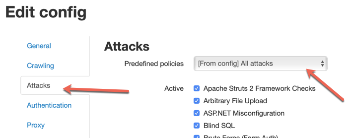
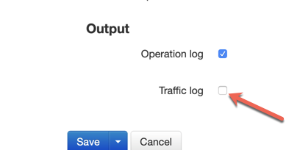
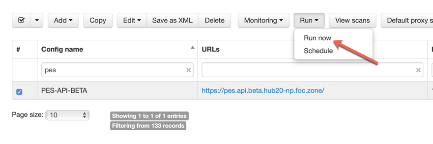
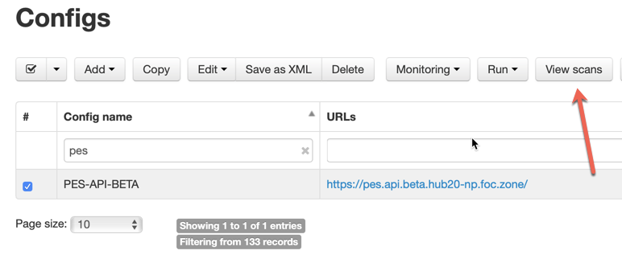
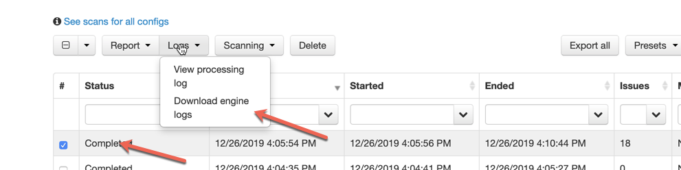

# AppSpider: Debugging Configuration Setup
If you are trying to setup your application in AppSpider and run into roadblocks this guide will help you learn how to debug your setup.

- Go to AppSpider (http://shorty/appspider) 
- Go to your application's Configuration
- Navigate to the "Attacks" option
  - Edit the "Attacks" to "Crawl Only"
  - 
- Go to "Performance" option
  - Enable the "Traffic Log"
  - 
- Save the configuration
- Run a scan
- 
- Click on "View Scans"
- 
- Select the Scan and then Click on the "Logs" drop down
- 
- "Download Engine Logs" and open them in a text editor, to identify the problem

### NOTE: Once the problem is resolved DO NOT FORGET to turn OFF the "Traffic Log" option, and update the "Attacks" from "Crawl" to "All Attacks" once more
